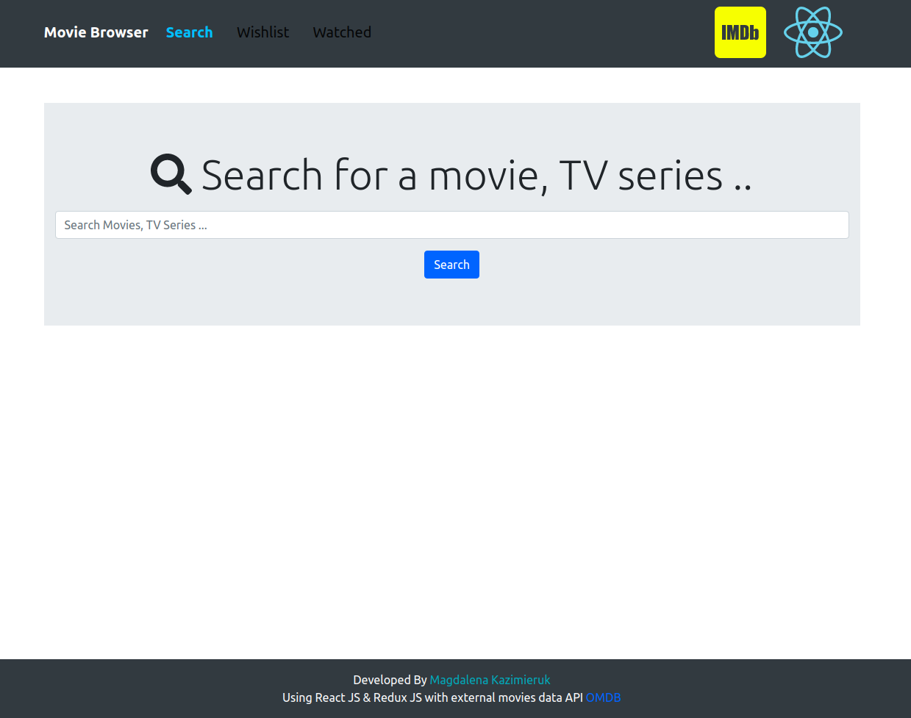
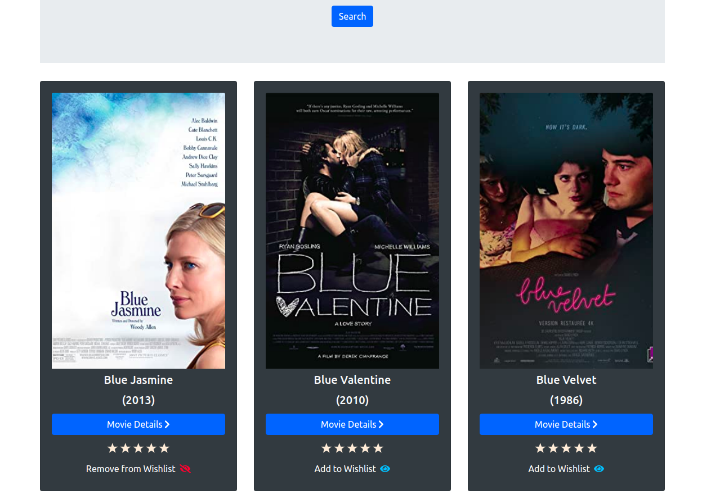
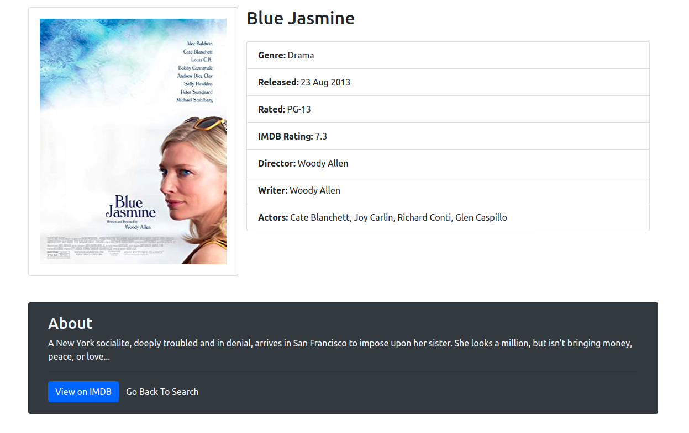
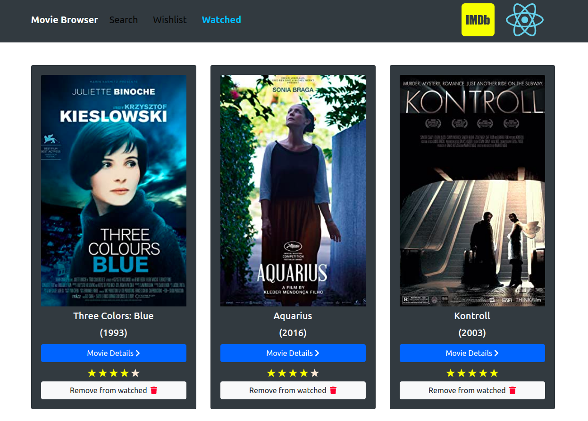

This project was bootstrapped with [Create React App](https://github.com/facebook/create-react-app).

## Get started

* Download the project and go to [OMDB API](http://www.omdbapi.com/) to generate your own API key. Then create a `.env` file in the project directory 
and type in REACT_APP_API_KEY=[your-api-key-here].

## Run the App

In the project directory, you can run:

### `npm start`

Runs the app in the development mode. 
Open [http://localhost:3000](http://localhost:3000) to view it in the browser.

The page will reload if you make edits. 
You will also see any lint errors in the console.

## About

This movie/TV series browser was created using React.js and Redux and it makes use of [OMDB API](http://www.omdbapi.com/).

The program allows you to:
- Browse movies and TV series by title
- Get detailed information on each movie together with similar movies recommendations
- Rate each movie, change your rating or delete a movie from your Watched Movies List at any time
- Save a movie or remove it from your Wishlist

The state of the application is persisted to the local storage.

### Movie Browser

### Browse Results

### Detailed View

### Watched Movies List

